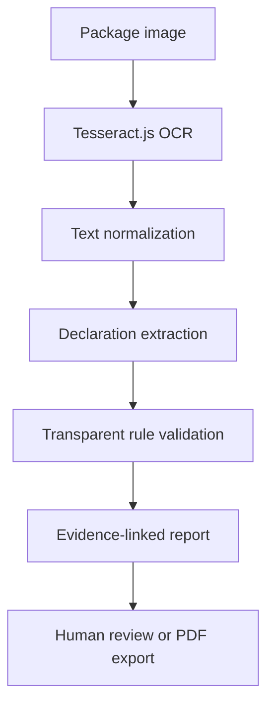

<div align="center">

# 📦 PackSure AI

### Evidence-linked packaged commodity compliance screening—directly in the browser

Upload a package-label image, extract its declarations with OCR, validate them against transparent rules, and generate an inspection-ready report.

[](https://packsure.vercel.app/)
[](https://www.sih.gov.in/)
[](https://nextjs.org/)
[](https://www.typescriptlang.org/)
[](https://tesseract.projectnaptha.com/)

[Live Demo](https://packsure.vercel.app/) · [Report an Issue](https://github.com/CtrlAltDefeattt/PackSure-AI/issues)

</div>

---

## Overview

PackSure AI is a privacy-first prototype built for **Smart India Hackathon 2026 problem statement SIH26034**. It helps screen packaged commodity labels for missing or potentially non-compliant declarations.

Instead of returning only a pass/fail result, PackSure AI connects every finding to:

- the value extracted from the label;
- the exact OCR evidence used;
- the rule applied;
- a confidence score; and
- an editable field for human verification.

The result is a transparent decision-support workflow suitable for inspectors, manufacturers, packers, retailers, and compliance teams.

> **Prototype scope:** PackSure AI assists compliance screening. It does not replace verification or enforcement by an authorized Legal Metrology officer.

## The Problem

Manual package-label inspection can be slow and difficult to scale. Important declarations may be absent, unclear, or spread across different parts of a label, while opaque automated systems make their decisions hard to verify.

PackSure AI addresses this with a traceable pipeline:

1. Capture or upload a package image.
2. Extract label text locally using browser-based OCR.
3. Identify mandatory declarations.
4. Apply readable compliance rules.
5. Show evidence, confidence, and verdicts.
6. Print or save the final report as a PDF.

## Current Compliance Checks

| Declaration | What PackSure AI looks for |
|---|---|
| Product identity | Common or generic product name |
| Net quantity | Quantity with a standard unit such as g, kg, ml, L, or pieces |
| MRP | Price declaration and the phrase “inclusive of all taxes” |
| Manufacturer / packer | Name of the responsible entity |
| Complete address | Address details associated with the responsible entity |
| Month and year | Manufacturing or packing date declaration |
| Consumer care | Consumer complaint contact details |
| Country of origin | Origin declaration for imported commodities |

Each check is classified as **Compliant**, **Violation**, or **Review**. Conditional or ambiguous cases are deliberately sent for manual review.

## Features

- **On-device OCR:** Tesseract.js processes uploaded images inside the visitor’s browser.
- **Privacy-first flow:** Package images are not uploaded to an application server.
- **Evidence-linked decisions:** Every verdict displays the matched source text and applied rule.
- **Human-in-the-loop review:** Extracted values can be corrected before the report is finalized.
- **Confidence indicators:** OCR-derived fields include confidence guidance.
- **Instant compliance score:** See passed, failed, and review-required checks at a glance.
- **Camera and gallery support:** Capture a label on mobile or select an existing JPG, PNG, or WEBP image.
- **Printable reports:** Export the inspection view using the browser’s Print / Save as PDF workflow.
- **Built-in SIH demo:** Explore the full interface without uploading an image.
- **No account or API key required:** The current prototype has no backend dependency or environment variables.

## How It Works



The current rule engine uses deterministic pattern matching. This makes the prototype fast, inspectable, and easy to audit: a reviewer can see why a declaration received its status.

## Tech Stack

| Layer | Technology |
|---|---|
| Framework | Next.js 16, React 19 |
| Language | TypeScript |
| Styling | Tailwind CSS 4 |
| UI primitives | Base UI and Radix UI |
| OCR | Tesseract.js 6 |
| Icons | Lucide React |
| Deployment | Vercel |

## Run Locally

### Prerequisites

- Node.js **20.9 or newer**
- npm

### Installation

```bash
git clone https://github.com/CtrlAltDefeattt/PackSure-AI.git
cd PackSure-AI
npm install
npm run dev
```

Open [http://localhost:3000](http://localhost:3000).

No environment variables are required.

### Production Build

```bash
npm run build
npm start
```

### Lint

```bash
npm run lint
```

## Using the Prototype

1. Open the [live demo](https://packsure.vercel.app/).
2. Click the upload area or use a phone camera to capture a clear label image.
3. Wait for the browser OCR process to complete.
4. Review the extracted declarations, verdicts, and confidence values.
5. Select a row to inspect its matched evidence and applied rule.
6. Correct any OCR value that needs human verification.
7. Choose **Print / save PDF report** to export the result.

For best results, use a sharp, well-lit image with the label text facing the camera directly.

## Project Structure

```text
PackSure-AI/
├── app/
│   ├── globals.css       # Theme, responsive styles, and print layout
│   ├── layout.tsx        # Application metadata and root layout
│   └── page.tsx          # OCR, extraction, validation, and report workflow
├── components/ui/        # Reusable button, progress, and table components
├── lib/utils.ts          # Shared class-name utility
├── public/               # Static assets and favicon
├── vendor/               # Vendored styling assets and license
├── package.json
├── vercel.json
└── README.md
```

## Privacy and Data Handling

The current version performs OCR in the browser. Uploaded images and extracted text are held only in the active page session and are not persisted by PackSure AI. Refreshing or closing the page clears the inspection state.

## Current Limitations

- OCR accuracy depends on lighting, focus, label curvature, font size, and image resolution.
- Recognition is currently configured for English text.
- Extraction uses prototype-level pattern matching and may miss unfamiliar label layouts.
- The rulebook covers the declarations shown above, not every legal exception or commodity category.
- Country-of-origin and address findings may require contextual human review.
- Reports are not stored, signed, or assigned to authenticated inspectors.
- The current compliance score is a screening indicator, not a legal certification.

## Roadmap

- [ ] Add image preprocessing for rotation, glare, blur, and perspective correction
- [ ] Support Hindi and additional Indian languages
- [ ] Expand and version the Legal Metrology rulebook
- [ ] Add category-aware and import-aware validation
- [ ] Highlight evidence directly on the package image
- [ ] Generate structured, signed inspection reports
- [ ] Add secure case history, authentication, and role-based workflows
- [ ] Measure OCR and rule accuracy on a representative labelled dataset
- [ ] Add batch scanning and compliance analytics

## Contributing

Suggestions and improvements are welcome.

1. Fork the repository.
2. Create a feature branch: `git checkout -b feature/your-feature`
3. Commit your changes: `git commit -m "Add your feature"`
4. Push the branch: `git push origin feature/your-feature`
5. Open a pull request.

For bugs or feature requests, please [open an issue](https://github.com/CtrlAltDefeattt/PackSure-AI/issues).

---

<div align="center">

Built as an explainable, privacy-first compliance screening prototype for **SIH 2026**.

</div>
